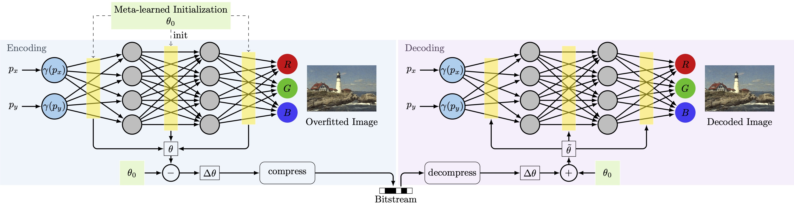

 # Implicit Neural Representations for Image Compression
### [Paper](https://arxiv.org/pdf/2112.04267.pdf)




## Requirements:
 - Ubuntu 18, CUDA11 capable GPU (these restrictions come from AIMET, other setups may work as well)
 - Anaconda installation capable of Python 3.6
## Repository Overview
The repository contains the following folders:
* data: contains scripts to download data, contains the datasets after the downloads are executed
* examples: contains example scripts to reproduce the most important results from the paper
* image_compression: contains the code to run image compression with INRs
* shape_compression: contains the code to run shape compression with INRs
* lib: contains third party code that we slightly adjusted to work with our codebase
* torchmeta: a third party library that we use for meta-learning

## Environment Setup
To create a conda environment for image compression and install all requirements run inside the project directory:
<pre><code>
conda env create --file environment.yml
conda activate INRcompress
export LD_LIBRARY_PATH=$LD_LIBRARY_PATH:$(pwd)/lib/aimet_common/x86_64-linux-gnu:$(pwd)/lib/aimet_common
export PYTHONPATH=$PYTHONPATH:$(pwd)/lib/aimet_common/x86_64-linux-gnu:$(pwd)/lib/aimet_common:$(pwd)/lib:$(pwd)
</code></pre>

If you wish to also install the dependencies to run the 3D shape compression code:
<pre><code>
conda env create --file environment3D.yml
conda activate INRcompress3D
export LD_LIBRARY_PATH=$LD_LIBRARY_PATH:$(pwd)/lib/aimet_common/x86_64-linux-gnu:$(pwd)/lib/aimet_common
export PYTHONPATH=$PYTHONPATH:$(pwd)/lib/aimet_common/x86_64-linux-gnu:$(pwd)/lib/aimet_common:$(pwd)/lib:$(pwd)
</code></pre>
## Implicit Neural Representations (INRs) 101
INRs are a way to represent coordinate based data as a function. For example, an image is nothing else but a function f(x,y) = (R,G,B),
namely we assign a (R,G,B) color to the pixel at location (x,y). We can train a neural network to fit this function by optimization
and what you get is an INR.

## Datasets
We provide scripts for DIV2K and Kodak that automatically download the dataset in the data directory.
For CelebA please follow these steps:
- Download img_align_celeba_png.7z from the official GDrive and place the extracted folder inside data/CelebA
- Download the list_eval_partition.csv file and also place it in data/CelebA
- execute the celeba100dataset.py script to extract the image subset we report on in the paper

We provide an example 3D shape, that is already normalized, in data/armadillo. The other shapes are available from
[The Stanford 3D Scanning Repository](https://graphics.stanford.edu/data/3Dscanrep/).
## Code Overview
To seperate dependencies, we split the code into two parts, namely 'image_compression' and 'shape_compression'.
We briefly describe the role of the individual python files in the folder 'image_compression' here.
* dataio.py: functions for reading in the data
* modules.py: contains the INR models
* utils.py: contains general utility functions, including summary writing and metrics computation
* losses.py: contains loss functions
* training.py: training loop to overfit an INR
* overfitINR.py: training script that builds an INR and overfits to am input of choice
* Quantizer.py: The Quantizer class that implements the quantization functionality, interfaces to AIMET
* quantize_utils.py: contain utility functions related to quantization specifically
* quantize_and_test.py: script that loads an INR, quantizes it, optionally performs AdaRound and/or QAT and tests the rate-distortion performance
* trainMetaSiren.py: learns a MAML initialization for a dataset of images
* overfitMetaSiren.py: performs the overfitting starting from a MAML intialization

The shape compression code follows the same structure, the only difference is that the scripts for overfitting and named 'overfitINR3D.py'
and 'quantize_and_test3D.py'.

## Running Image Compression with INRs


### Option 1: Basic Method: Overfitting from random initialization

Run
```
python overfitINR.py <general flags> <architecture flags> <overfitting flags>
```
to overfit an INR to single images.
This function takes the following arguments as flags: <br>

&lt;general flags&gt;:
* data_root: root directory of you datasets, one folder above the actual dataset, e.g <data_root>/<dataset>
* exp_root: root directory of your experiments, typically 'exp'

&lt;architecture flags&gt;:
* activation: activation function of the neurons, for 'sine' we use sin(30x) as in the original SIREN
* encoding: type of coordinate encoding used:
  * 'mlp': basic MLP without any input encoding
  * 'nerf': positional encoding as in NeRF but with a variable scale parameter
  * 'positional': positional encoding as described in Tancik et. al. [2020]
  * 'gauss': Gaussian encoding as described in Tancik et. al. [2020]
* encoding_scale: scale parameter for the positional encoding, varies spacing of frequencies
* hidden_dims: number of hidden dimensions of the MLP -> width of MLP (same for all hidden layers)
* hidden_layers: number of hidden layers -> depth of the MLP
* ff_dims: Number of fourier feature frequencies for the input encoding at different scales

&lt;overfitting flags&gt;:
* dataset: the name of your dataset, e.g. KODAK, the code will look for the image files in <data_root>/<dataset>
* epochs: number of epochs to run training for, since 1 batch = 1 image this is equal to the number of optimization steps
* lr: learning rate of Adam optimizer
* l1_reg: L1 regularization strength on the weights of the INR, e.g. 0.00001
* downscaling_factor: factor by which to downsample the input image
* patience: patience parameter for learning rate schedule
* epochs_til_ckpt: epochs until a checkpoint is stored
* steps_til_summary: steps/epochs until summary is written

### Option 2: Meta-learned Method: Overfitting from MAML initialization
First train the MAML initialization:

```
python image_compression/trainMetaSiren.py <general flags> <architecture flags> <MAML flags>
```
This function takes a very similar set of parameters as listed above with a few additional ones that are MAML specific:
&lt;MAML flags&gt;:
* maml_epochs: number of epochs to perform maml training, note that here one epoch is a pass over the full dataset containing many images
* lr_type: type of learning rate used in the inner loop (as suggested by the Meta Siren work)
  * 'static': static learning rate in the inner loop, learning rate is not learned and the same for all parameters and steps
  * 'global': the inner loop learning rate is learned, the same learning rate is used for all parameters and steps
  * 'per_step': a separate learning rate is learned for each inner loop step, per step the learning rate is the same for all parameters
  * 'per_parameter': a separate learning rate is learned for each parameter that is used for all inner loop steps
  * 'per_parameter_per_step': a separate learning rate is learned for each parameter at each inner loop step, i.e. the total number of learning rates that are optimized is 3 x num_parameters
* maml_batch_size: number of images over which the outer loop gradient is accumulated before updating the outer loop
* maml_adaption_steps: number of inner loop steps in MAML
* inner_lr: initial value for learning rate of the inner loop
* outer_lr: initial value for learning rate of the outer loop

Once we have the MAML initialization we can overfit single images starting from that initialization.
The MAML initialization are stored in a 'maml' subfolder in the exp_root
By providing the same architecture flags and exp_root as in the MAML training step, the correct initialization will be automatically found when running:
```
python image_compression/overfitMetaSiren.py <general flags> <overfitting flags> <MAML flags>
```
You also need to pass the MAML flags from above to overfitMetaSiren.py.
This differs from normal overfitting in that we first perform an inner loop optimization to leverage the learned learning rates.
Then we continue with the overfitting as in Option A.

### Quantization, AdaRound, QAT, Entropy Coding

The compression pipeline is run with the command:
```
python image_compression/quantize_and_test.py --exp_glob <my_experiments_regular_expression> <general flags> <quantization flags>
```
Please provide the experiment name(s) you want to run this for as the exp_glob as a regular expression. If exp_glob is set to '*' all experiments
in the exp_root directory will get quantized. This script automatically detects models that were trained with a MAML initilization and uses it for 
quantization in this case. Note that the architecture of the model gets extracted from the training flags in FLAGS.yml stored in the experiment folder.
Arguments you can modify through flags:

&lt;quantization flags&gt;:
* dataset: the name of your dataset, e.g. KODAK, the code will look for the image files in <data_root>/<dataset>
* bitwidth: number of bits to store a parameter, e.g. 8
* adaround: whether to use AdaRound, default is true, pass '--noadaround' to disable AdaRound
* retrain: whether to use quantization aware retraining, default is true, pass '--noretrain' to desable retraining
* retrain_lr: learning rate to refine model during quantizaiton aware retraining, typically lower than normal learning rate
* adaround_reg: regularization parameter for AdaRound, default 0.0001 should be good for most cases
* adaround_iterations: number of optimization iterations of adaround, e.g. 1000
* code: which code to use for entropy coding, supports 'arithmetic' (entropy optimal) and 'brotli' (general purpose byte coder)
* skip_existing: automatically skip experiments that have already been quantized with the same setting, default is true, disable by passing '--noskip_existing'

### Example Experiment Scripts
We provide example scripts in the folder 'experiment_scripts' that use our chosen hyperparameters to reproduce the main result (Fig.4) from the paper:
* run_basic_kodak.sh: Basic method (without meta-learning) for KODAK
* run_basic_celeba.sh: Basic method (without meta-learning) for CelebA
* run_maml_kodak.sh: Meta-learned method for KODAK
* run_maml_celeba.sh: Meta-learned method for CelebA

Run
```
chmod +x examples/run_basic_kodak.sh 
examples/run_basic_kodak.sh 
```
or similarly for the other scripts.


## Running 3D Shape Compression with INRs
As an additional experiment, we showed in the paper that INRs are also effective for compression 3D shapes. At this point,
we only support the overfitting functionality for shapes. The procedure is almost the same as for images, hence we will only point
out the differences.
### Normalizing the shapes
To learn the representaions we first need to normalize the '.obj' shapes to the unit cube. For this we run:
```
python shape_compression/normalize_shapes.py --shape_glob "<path_path_to_my_shape_dataset>/*.obj"
```
Note that the double quotes " " are needed here to prevent Linux from evaluating the regular expression. If the shapes are
deeper inside a directory tree, modify the glob expression to: "<path_path_to_my_shape_dataset>/**/*.obj"
### Overfitting a 3D shape

Run
```
python shape_compression/overfitINR3D.py <general flags> <architecture flags> <overfitting flags>
```
to overfit an INR to all individual shapes in the dataset.

The flags this function takes are the same as for overfitting an image, except:
* samples_per_shape: defines the number of point samples taken from the groundtruth mesh to train the signed distance function
* batch_size: defines the number of point samples used for an optimization step
* ~~downscaling_factor~~: this flag is removed because it is related to downsampling the input image

### Quantization, AdaRound, QAT, Entropy Coding for 3D shapes

The compression pipeline for 3D shapes is run with the command:
```
python shape_compression/quantize_and_test3D.py --exp_glob <my_experiment_regular_expression> <general flags> <quantization flags>
```
The overfitting flags for this function are the same as for image_compression. (The architecture flags, samples_per_shape and batch_size are extracted
from the training flags stored in FLAGS.yml)


## Acknowledgement
We make use of the code published in the following repositories:
- AIMET: Quantization, QAT and Adaround (modified) <https://github.com/quic/aimet>
- SIREN: Implementation of INR (including torchmeta) <https://github.com/vsitzmann/siren>
- MetaSDF: Meta-Learning Initializations <https://github.com/vsitzmann/metasdf>
- Arithmetic Coding Implementation (modified): <https://github.com/nayuki/Reference-arithmetic-coding>
## Citation

```
@inproceedings{strumpler2022inrcompress,
  title={Implicit Neural Representations for Image Compression},
  author={Yannick Strümpler and Janis Postels and Ren Yang and Luc Van Gool and Federico Tombari},
  year={2022},
  booktitle={ECCV},
}
```